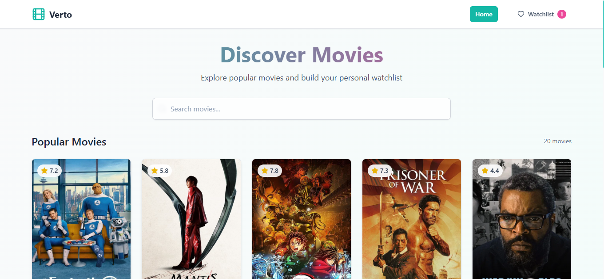
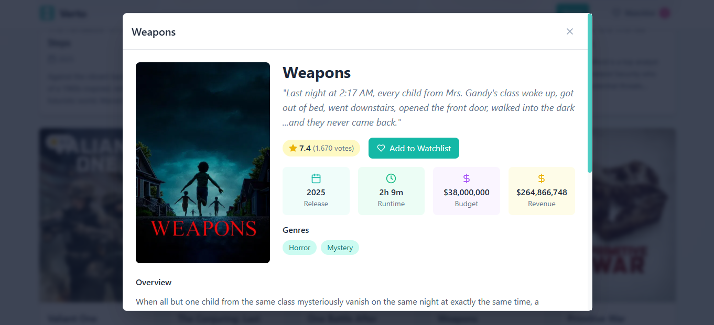
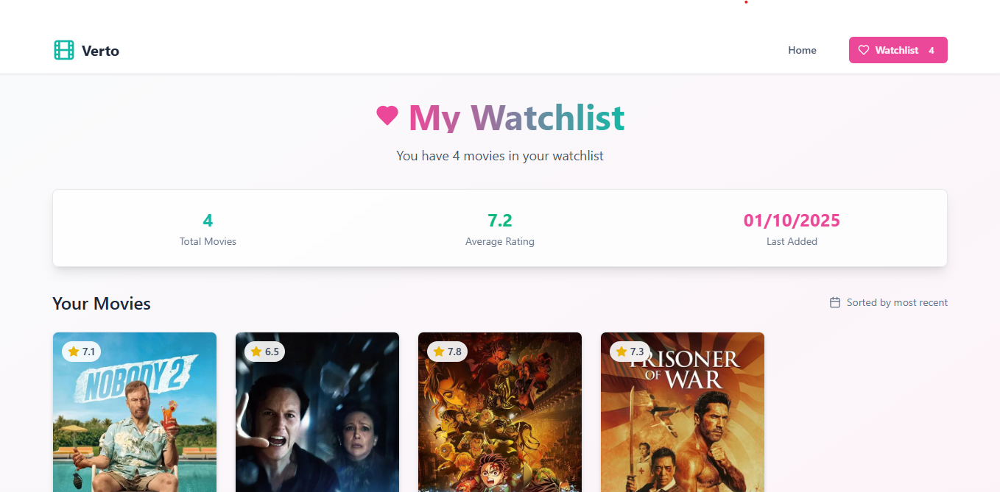

# Verto 

A sleek movie library web app built with **React**, **Vite**, and **Tailwind CSS**, powered by the TMDb API.  
Browse trending films, search titles, and manage a personal watchlist — all in a modern, responsive interface.

---

##  Problem Statement & Goal

**Movie Library**

**Project Goal**  
Create an app that allows users to browse movies and manage their own “watchlist.”

**Core Features**

- Fetch a list of popular movies via a free movie API (TMDb) on page load  
- Search movies by title  
- Display movies in a grid with posters and titles  
- Allow users to “Add to Watchlist”; this data should persist using **localStorage**  
- Provide a separate **Watchlist** view showing all saved movies  

---

## 📸 Screenshots

*(Insert images/screenshots here from your project — e.g. homepage, watchlist modal, movie detail popups)*  

---  

## 🛠 Tech Stack & Tools

- **React** — UI library  
- **Vite** — Fast dev server & build tool  
- **Tailwind CSS** — Utility-first styling  
- **VS Code** — Dev environment  
- **TMDb API** — Movie data (titles, images, metadata)  

---

## 🚀 Getting Started

### Prerequisites

- Node.js (LTS recommended)  
- npm (or yarn)  
- TMDb API key (create an account and generate one at themoviedb.org)

## Verify your installations:

node --version  
npm --version

## Setup & Installation

Install dependencies:

npm install

Create .env in project root with TMDb configuration:

VITE_TMDB_BASE_URL=https://api.themoviedb.org/3  
VITE_TMDB_IMAGE_BASE_URL=https://image.tmdb.org/t/p/w500  
VITE_TMDB_API_KEY=your_api_key_here

Replace your_api_key_here with your actual TMDb key.

>Running the App : 
npm run dev

By default, your app should run (e.g.) at http://localhost:5173.

📁 Project Structure : 
verto/
├── src/
│   ├── components/     # Reusable UI components (MovieCard, Modal, etc.)
│   ├── pages/          # Views (Home, Search, Watchlist)
│   ├── services/       # API calls, fetch logic
│   ├── context/        # State/context providers
│   └── types/          # types of content
|── App.jsx             #Root component / routing setup
├── public/             # Static assets, index.html
├── package.json        # Dependencies & scripts
└── .env                # Environment variables (not committed)

## Usage & Features

>Homepage / Discover – Shows popular movies right on load.
>Search – Type a title and fetch matching movies.
>Add to Watchlist – Click a button to save a movie.
>Watchlist View – See all your saved movies in one place.
>Remove from Watchlist – Option to remove a movie from saved list.
>Routing – Navigate between Home, Search, Watchlist without full page reloads.

## Acknowledgments

>TMDb (The Movie Database) — for the API and movie metadata
>React, Vite, Tailwind CSS — essential frameworks & libraries
>Open-source community — for tutorials, code inspiration, and assistance
>Bolt New Ai — for quick coding and support

Thank you for checking out Verto!
I hope this README helps others to understand, use, and contribute to your project.